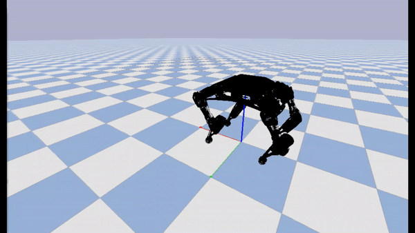

# bittle-simulation

## Using Reinforcement Learning to Train [Petoi's Bittle](https://bittle.petoi.com/) Quadruped Robot

### Usage
- `bittle_env.py`: Custom OpenAI Gym environment using Pybullet
- `bittle_train.py`: Driver to create gym environment, train model, and save model within the `Training` directory
- `bittle_watch.py`: Load trained model and view Bittle being simulated in Pybullet's GUI

### Trained Example


### Watch Bittle Walk
```commandline
python bittle_watch.py
```
### Train Bittle
```commandline
python bittle_train.py
```

### References
- [Bittle URDF and obj files](https://github.com/AIWintermuteAI/Bittle_URDF)
- [Prior Work](https://github.com/ger01d/opencat-gym)
